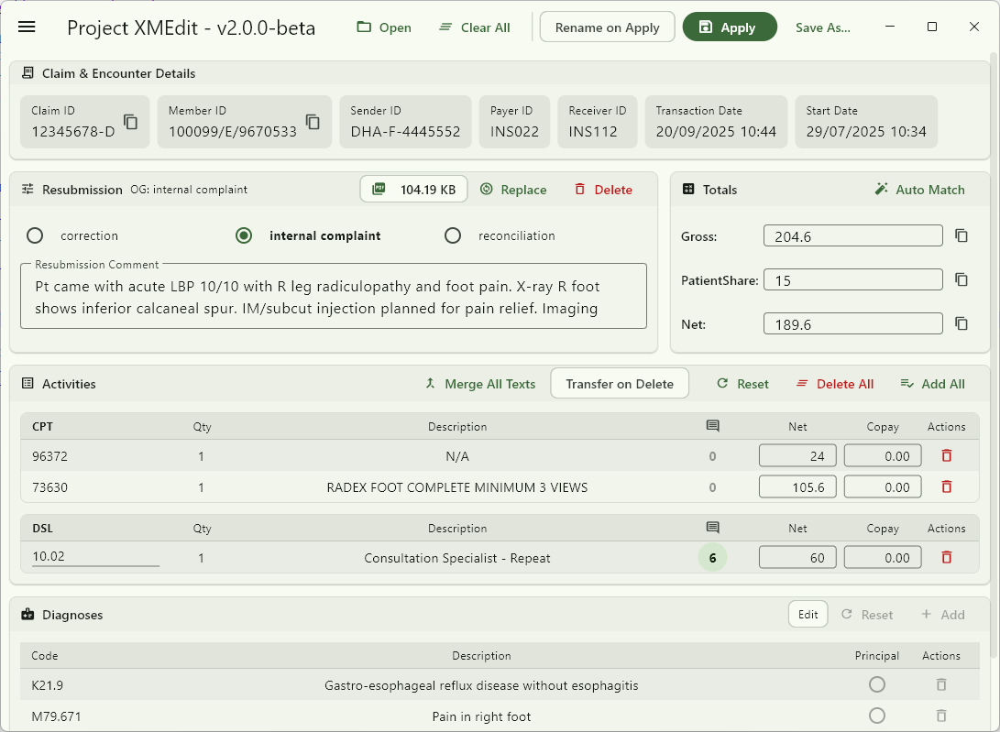

# Project XMEdit

A desktop application built with Flutter for manually editing specific DHPO XML medical resubmission claim files. This tool is designed to streamline the claim correction process with a user-friendly interface and a built-in validation engine.



---

## ✨ Features

* **Comprehensive Editing:** Modify claim details, totals, activities, and resubmission data.
* **Diagnosis Management:** Add/delete diagnoses with a built-in ICD-10 code and description search.
* **Observation Manager:** Full CRUD (Create, Read, Update, Delete) support for observations, including file attachments with drag-and-drop.
* **Bulk Operations:** Merge text-based observations and transfer observations from deleted activities.
* **Customizable UI:** Supports both Dark and Light modes with multiple theme colors.

---

## 🚀 Installation

Downloaded the pre-built `.zip` file from the [Releases](https://github.com/RaidenExn/project_xmedit/releases/latest) page.

### **1. Install Required Runtime**
This application requires the Microsoft Visual C++ Redistributable to run.
* **Download and install the latest version from the official Microsoft website:** [**Visual C++ Redistributable (X64 Version)**](https://aka.ms/vs/17/release/vc_redist.x64.exe)

### **2. Unzip and Run**
1.  Unzip the downloaded release file.
2.  Open the folder and run `project_xmedit.exe`.


## 📋 Building Requirements

* Flutter SDK (version 3.x or higher)
* A code editor like VS Code or Android Studio
* Git for version control
---

## 🚀 Getting Started

### 1. Clone the Repository
```bash
git clone https://github.com/your-username/project_xmedit.git
cd project_xmedit